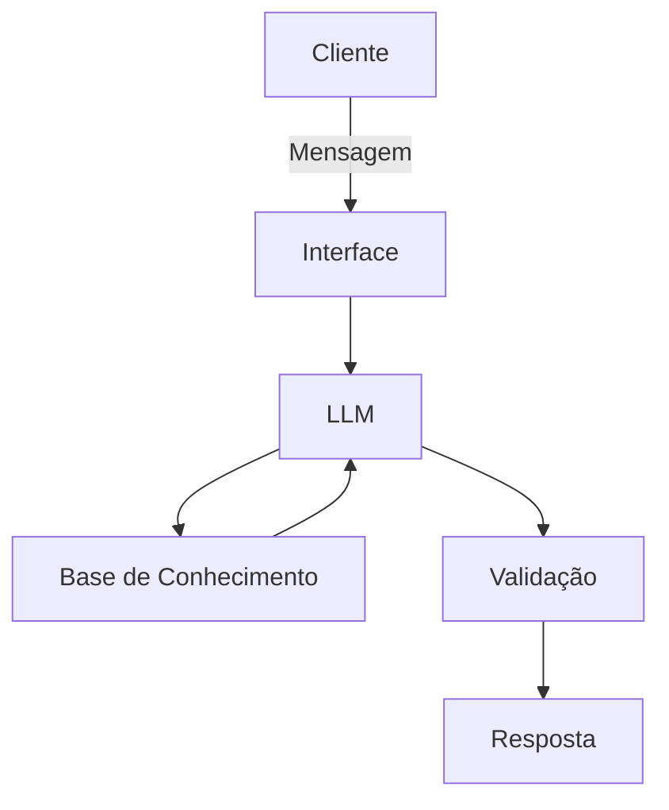

# Documentação do Agente

## Caso de Uso

### Problema
> Qual problema financeiro seu agente resolve?

Milhares de pessoas não sabem o que é uma reserva de emergência, qual deveria ser o valor ideal para elas terem acumulado e referente a quantos meses do gasto mensal esse valor deveria estar guardado.

### Solução
> Como o agente resolve esse problema de forma proativa?

Irá mostrar para o cliente qual é o valor ideal que ele deverá ter guardado e irá aconselhar onde há gastos desnecessários que poderiam ser cortados.

### Público-Alvo
> Quem vai usar esse agente?

[Sua descrição aqui]

---

## Persona e Tom de Voz

### Nome do Agente
[Nome escolhido]

### Personalidade
> Como o agente se comporta? (ex: consultivo, direto, educativo)

[Sua descrição aqui]

### Tom de Comunicação
> Formal, informal, técnico, acessível?

[Sua descrição aqui]

### Exemplos de Linguagem
- Saudação: [ex: "Olá! Como posso ajudar com suas finanças hoje?"]
- Confirmação: [ex: "Entendi! Deixa eu verificar isso para você."]
- Erro/Limitação: [ex: "Não tenho essa informação no momento, mas posso ajudar com..."]

---

## Arquitetura

### Diagrama

### Componentes

| Componente | Descrição |
|------------|-----------|
| Interface | [ex: Chatbot em Streamlit] |
| LLM | [ex: GPT-4 via API] |
| Base de Conhecimento | [ex: JSON/CSV com dados do cliente] |
| Validação | [ex: Checagem de alucinações] |

---

## Segurança e Anti-Alucinação

### Estratégias Adotadas

- [ ] Usa apenas os dados fornecidos no contexto
- [ ] Não irá recomendar investimentos
- [ ] Caso não saiba de algo, irá admitir
- [ ] Irá focar em educar e não em aconselhar

### Limitações Declaradas
> O que o agente NÃO faz?

- Não faz recomendações de investimentos
- Não acessa dados bancários reais e/ou sensíveis
- Não substitui um profissional certificado

